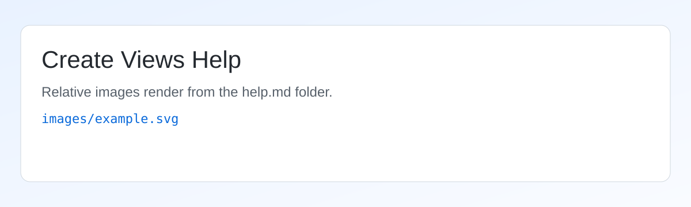

# Create Views Help

[TOC]

## Quick Start

1. Choose Phase, naming options, and plan type defaults.
2. Select levels on the right and click Add.
3. Review the queue and edit names or scope boxes.
4. (Optional) enable On Sheet rows and set a template sheet.
5. Click Create.

!!! note "Enterprise behavior"
    This help file is read as UTF-8 and rendered at runtime only when Help is clicked.
    That keeps startup fast and avoids loading markdown dependencies unless needed.

## Naming Tokens

Use tokens in Name Pattern:

| Token | Meaning | Example |
| --- | --- | --- |
| `{phase}` | Selected phase name | New Construction |
| `{phase_abbrev}` | Custom phase abbreviation combo value | NC |
| `{plan_type}` | Plan label for row | Floor |
| `{scopebox}` | Scope box name (if assigned) | Core A |
| `{level}` | Level name | Level 02 |

Case modifiers are supported with `~upper`, `~lower`, and `~title`.

```text
{phase_abbrev~upper}-{level~upper}-{plan_type~upper}
```

## Queue and Sheet Notes

!!! warning "Validation"
    Included sheet rows require a valid sheet template with a titleblock and at least one plan viewport.

- Use Include All / Include None for fast bulk updates.
- Sheet No. Override takes precedence over generated numbering.
- Duplicate names in queue are blocked before creation.

## Relative Image Example

The image below is loaded from a path relative to this file:



## Links

- Internal anchor: [Jump to Naming Tokens](#naming-tokens)
- External link: [pyRevit docs](https://pyrevitlabs.io/)

## Example Folder Structure

```text
CreateViews.pushbutton/
  bundle.yaml
  script.py
  CreateViews.xaml
  help.md
  images/
    example.svg
```
